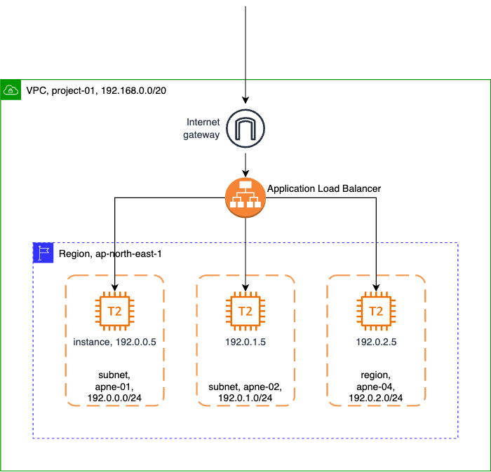

## Summary

A simple project of load-balancing instances in different availability zone.

## Diagram

## Note

in AWS, for a subnet 192.168.0.0/24, you are not allowed to use 192.168.0.1 as it is reserved.
