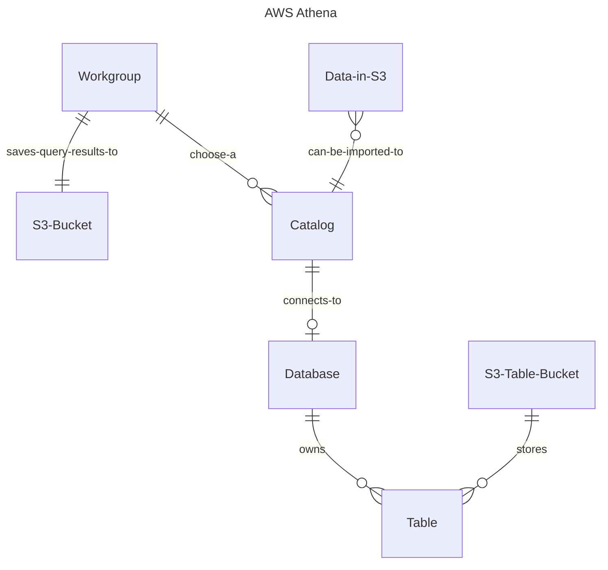

## Summary

very simple provision for s3 & athena

## Overview



## S3 Table

s3 table bucket does not share namespace with normal s3 bucket, i.e. you can have 2 buckets with same name, one in s3, one in s3 table.

create database & table would result in a 0-byte txt file in s3, while selects, inserts etc. would result in a metadata and .csv file

deletion:
```sh
aws s3tables delete-table-bucket \
  --table-bucket-arn arn:aws:s3tables:xxx
```

## Amazon Athena

Athena resources (workgroup, database) does not allow hypen, only _ for symbols

Athena can analyze external table or iceberg table created from s3 bucket.

## Iceberg Table

(Apache) Iceberg is an open-source data format for data analysis with query statement similar to SQL.

Example creating Iceberg table
```sql
CREATE TABLE product (
  id integer,
  name string,
  on_sale boolean
)
LOCATION 's3://s3-bucket/'
TBLPROPERTIES ( 'table_type' = 'ICEBERG' );
```

## Different data storage

| Resource | Data Query | Query Language |
|----------|------------|----------------|
| S3       | Athena     | Athena SQL     |
| Dynamo   | RedShift   | PartiQL        |

## API Gateway

Essentially REST-api in OpenAPI spec.
